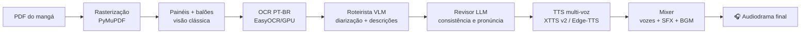

# 🎧 MangaWhisperer

**Narração imersiva multi-voz de mangás em PT-BR para leitores cegos** — um pipeline
agêntico de ponta a ponta que transforma um PDF de mangá em um audiodrama completo:
vozes distintas por personagem, descrições de cena geradas por IA, sonoplastia e
trilha de fundo.

> *EN — MangaWhisperer is an end-to-end agentic pipeline that turns manga PDFs into
> fully produced Brazilian-Portuguese audio dramas for blind and low-vision readers:
> per-character voices, AI-written scene descriptions, sound effects and background
> music, orchestrated by vision-language models with an LLM review layer.*

---

## Como funciona



O **roteirista** (estágio 5) é um modelo de visão-linguagem que olha cada painel,
atribui as falas aos personagens (Guts, Griffith, Casca…), converte onomatopeias em
fala expressiva ("SIMMMM!!!" → "Siiim!"), escreve descrições de ação para o que só
existe visualmente — o coração da acessibilidade — e escolhe efeitos sonoros da
biblioteca. O **revisor** (estágio 6) relê o roteiro inteiro com visão global e
corrige inconsistências que o roteirista, trabalhando painel a painel, não enxerga.

## Destaques de engenharia

- **Arquitetura plugável por contratos**: cada estágio é uma ABC com contratos de
  dados Pydantic v2; trocar o provedor do roteirista (Qwen API ➜ OpenAI ➜ Kimi ➜
  Anthropic ➜ Qwen local na GPU) é um argumento de linha de comando.
- **Retomada com fingerprints**: cada estágio grava checkpoints identificados pela
  configuração exata dos motores (modelo, prompt, parâmetros). Uma execução
  interrompida retoma sem repetir chamadas pagas de API — e um checkpoint gerado
  por outra configuração é invalidado automaticamente.
- **Sonoplastia em três camadas**: o roteirista escolhe efeitos; um tagger
  determinístico por palavras-chave garante os momentos óbvios; e efeitos novos
  entram por upload com classificação automática (CLAP zero-shot, local).
- **Mixagem em dois barramentos**: narração+efeitos com ganhos independentes e
  trilha de fundo em loop com fade, em numpy puro.
- **Estilos de narração**: presets (Sombrio / Épico / Neutro) que ajustam
  simultaneamente o prompt do roteirista, o ritmo do TTS e as pausas.
- **Configuração única do pipeline**: CLI e UI constroem o mesmo `PipelineConfig`
  validado e chamam `build_pipeline`; a ordem de montagem dos motores existe em
  um só lugar.
- **Heurísticas sem token**: segmentação de painéis por rede de sarjetas e
  perfis de projeção (spreads duplos, sarjetas finas, ordem rtl/ltr), filtro
  determinístico de lixo de OCR e plano de narração puro — tudo antes de
  gastar um token de modelo.
- **225 testes offline** (mais um gated que baixa modelos reais), cobrindo dos
  contratos Pydantic ao smoke E2E do CLI.

## Quickstart

Requisitos: Python 3.11, GPU NVIDIA (recomendado; CPU funciona mais lento) e uma
chave de API para o roteirista (qualquer provedor suportado).

```bash
python -m venv .venv
.venv\Scripts\pip install -e ".[dev,engines,vlm,vlm-api,tts,ui]"
# GPU NVIDIA série 50xx (Blackwell): torch do canal cu128
.venv\Scripts\pip install --force-reinstall --no-deps torch torchvision torchaudio --index-url https://download.pytorch.org/whl/cu128

# Biblioteca de efeitos e trilhas (CC0 / procedurais)
.venv\Scripts\python scripts/download_sfx.py
.venv\Scripts\python scripts/generate_placeholder_bgm.py

# Chave do provedor (um deles)
set DASHSCOPE_API_KEY=...    # Qwen (padrão)  |  ANTHROPIC_API_KEY / OPENAI_API_KEY / MOONSHOT_API_KEY
# ...ou 100% local, sem chave: llama-server + GGUF (--vlm llamacpp; veja docs/adr/0004-vlm-local-fora-do-processo.md)
set LLAMA_MODEL_GGUF=C:\models\qwen3-vl-8b-q4_k_m.gguf
set LLAMA_MMPROJ_GGUF=C:\models\mmproj-qwen3-vl-8b-f16.gguf

# Demo de 3 páginas (use um PDF seu — veja a nota legal)
.venv\Scripts\python main_demo.py --pdf "caminho/do/seu/manga.pdf" --pages 3 --style sombrio

# Interface web completa
.venv\Scripts\python app.py
```

A interface web permite: upload do PDF, escolha de provedor/modelo com a sua
própria chave, estilo de narração, intensidade da sonoplastia, trilha e volumes por
canal, revisão ativável — e uma aba de **biblioteca de sons** onde seus próprios
efeitos são etiquetados automaticamente por IA.

## Referência de narração humana (opcional, uso local)

`python -m tools.transcribe_reference --audio <arquivo>` transcreve uma narração
humana com faster-whisper e extrai ritmo (pausas, palavras/min) e excertos de
estilo para servir de exemplo ao roteirista. O áudio e a transcrição são obra de
terceiros: ficam fora do git (`assets/reference/`) e só para estudo pessoal — veja
`docs/reference-narration.md`.

## Custos (referência, ago/2026)

O TTS, o OCR e a visão clássica rodam localmente (custo zero). Só o
roteirista/revisor usam API — por volume de ~220 páginas:

| Provedor / modelo | Custo aproximado por volume |
|---|---|
| Qwen `qwen3-vl-flash` | ~US$ 0,05–0,25 |
| Qwen `qwen3-vl-plus` (padrão) | ~US$ 0,20–1,00 |
| OpenAI `gpt-5.6-luna` | ~US$ 0,20–0,90 |
| Anthropic `claude-opus-4-8` | ~US$ 5–25 |

## Limitações conhecidas (honestas)

- A segmentação de painéis é visão clássica (rede de sarjetas + corte por perfis
  de projeção): separa layouts com sarjetas retas, mas arte ou balões que
  atravessam a sarjeta ainda fundem painéis; a integração de um detector
  treinado (comic-text-detector/Magi) está no roteiro.
- As vozes vêm dos speakers embutidos do XTTS v2 — clonagem por referência é
  suportada pelo motor, mas ainda não exposta na UI.
- O Edge-TTS usa um endpoint não-oficial da Microsoft: funciona, mas é um fallback,
  não uma fundação.

## Nota legal — importante

Este repositório contém **apenas código**. Nenhum mangá está incluído e nenhum
áudio derivado de obra protegida é distribuído. Para usar o sistema, forneça PDFs
que você possui legalmente. Os efeitos sonoros baixados pelos scripts são CC0
(OpenGameArt/Kenney). O modelo XTTS v2 é licenciado sob CPML (uso não-comercial) —
avalie as licenças dos modelos antes de qualquer uso além do pessoal.

## Como este projeto foi construído

Desenvolvido em **par com IA** — engenharia conduzida em sessões agênticas com o
Claude (Anthropic), que assina coautoria nos commits: arquitetura orientada a
contratos, TDD do primeiro esqueleto mockado até os 225 testes atuais, pesquisa
automatizada de dependências e preços, e validação incremental por áudio real em
cada marco. As decisões de produto, a direção e as validações são do autor. O
histórico de commits reflete a evolução real do sistema.

---

**Status**: primeira versão funcional (v0.1). Código visível para fins de
portfólio; **todos os direitos reservados** (licença a definir).
